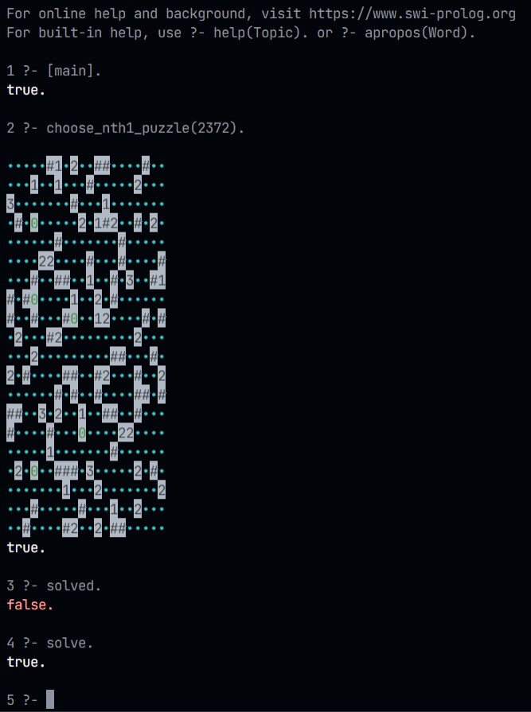
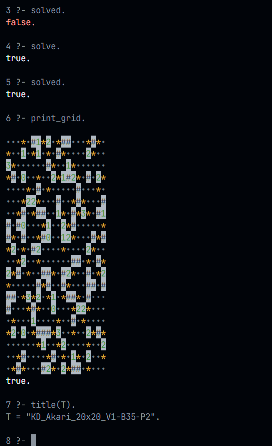
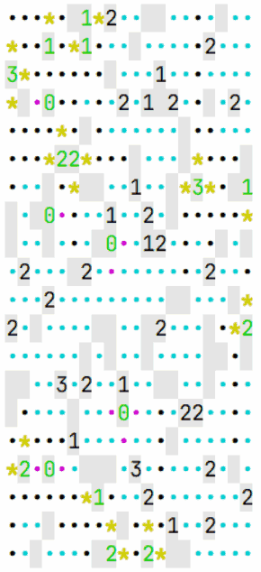
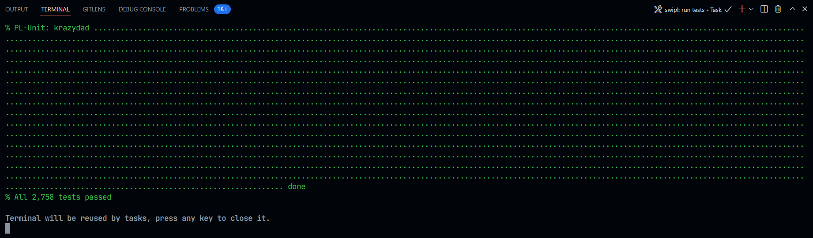

# Light-Up / Akari Puzzle Solver

A solution finder for the puzzle game known as [Light-Up/Akari][akari] written in [Prolog] using [SWI-Prolog].

## Screenshots

### Load a puzzle

### Solve a puzzle

### Searching for solution with backtrack

### All tests passed

## Features

- Made with **T**est **D**riven **D**evelopment.
- Uses backtracking **only** when no action can be taken deterministically.
- Written in a modular fashion.
- Can be run in an headless mode.
- Pretty colored output for CLI usage.
- Uses a test suit of ~2,760 puzzles (of sizes 8x8 and 20x20).
- Works with non-squared puzzles.
- Supports 0,1,2,3 and 4 numbered walls.

## Benchmarks

- Solves (all?) 8x8 puzzles under 3 seconds.
- Can solve many 20x20 levels under 3 seconds.
- Some hard 20x20 levels can take up to 10 minutes to be solved.
- The whole test suit of 2,760 puzzles takes ~20 minutes to run with no failures.

[akari]: https://en.wikipedia.org/wiki/Light_Up_(puzzle)
[Prolog]: https://en.wikipedia.org/wiki/Prolog
[SWI-Prolog]: https://www.swi-prolog.org/

## Contributors

- [Rami Sabbagh](http://rami-sabbagh.github.io/) ([rami.sab07@gmail.com](mailto:rami.sab07@gmail.com)).
- Maias Alakramy.
